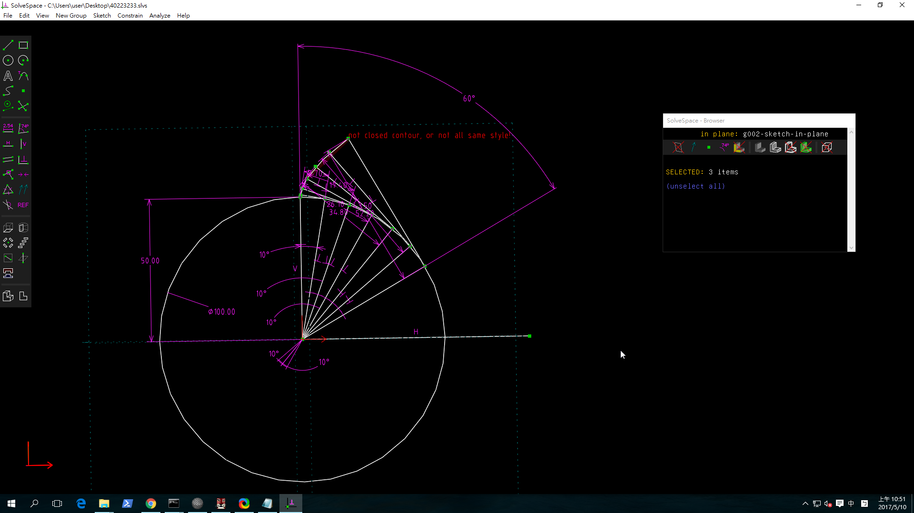

Title: W12 齒輪
Date: 2017-05-10 11:00
Category: Course
Tags: 0510 
Slug: 齒輪
Author: 40223233

<!-- PELICAN_END_SUMMARY -->

齒輪的基本 畫法
2D 和 3D 圖以及共軛敘述

<a href="https://vimeo.com/216777163">漸開線實畫</a>

